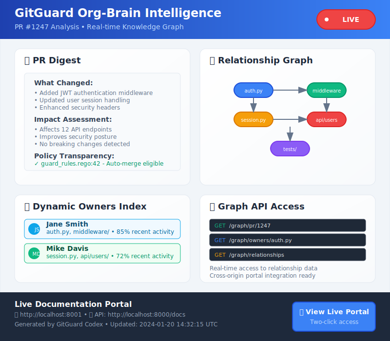
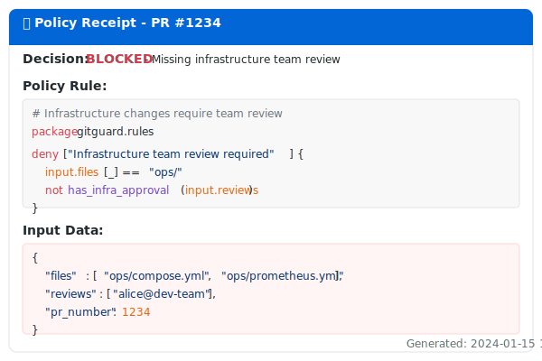
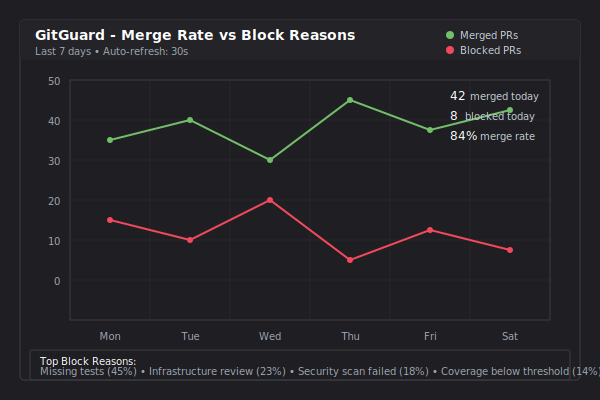

<div align="center">

# 🛡️ GitGuard

**AI-Powered Repository Security & Compliance Platform**

*Intelligent code analysis, policy enforcement, and security automation for modern development workflows*

[](https://opensource.org/licenses/MIT)
[](https://www.python.org/downloads/)
[](https://www.docker.com/)
[](https://kubernetes.io/)
[](https://github.com/Ava-Prime/gitguard/security)

<!-- Repository Activity Badges -->
[](https://github.com/Ava-Prime/gitguard/stargazers)
[](https://github.com/Ava-Prime/gitguard/watchers)
[](https://github.com/Ava-Prime/gitguard/network/members)

<!-- Release and Package Badges -->
[](https://github.com/Ava-Prime/gitguard/releases/latest)
[](https://github.com/Ava-Prime/gitguard/releases)
[](https://hub.docker.com/r/gitguard/gitguard)
[](https://hub.docker.com/r/gitguard/gitguard)
[](https://github.com/Ava-Prime/gitguard/pkgs/container/gitguard)

<!-- Build and Quality Badges -->
[](https://github.com/Ava-Prime/gitguard/actions/workflows/ci.yml)
[](https://github.com/Ava-Prime/gitguard/actions/workflows/release.yml)
[](https://codecov.io/gh/Ava-Prime/gitguard)
[](https://www.codefactor.io/repository/github/Ava-Prime/gitguard)

<!-- Observability and Security Badges -->
[](https://github.com/Ava-Prime/gitguard/actions/workflows/docs.yml)
[](https://github.com/Ava-Prime/gitguard/pkgs/container/gitguard)
[](https://github.com/Ava-Prime/gitguard/attestations)
[](https://github.com/Ava-Prime/gitguard/attestations)
[](https://github.com/Ava-Prime/gitguard/pkgs/container/gitguard)

---

## 🌟 **Experience GitGuard Instantly - No Setup Required!**

<table>
<tr>
<td align="center" width="33%">

### 🌐 **Live Demo**
[](https://ava-prime.github.io/gitguard/demo/)

*Try GitGuard in your browser*
*No installation needed*

</td>
<td align="center" width="33%">

### ⚡ **One-Click Deploy**
[](https://railway.app/template/gitguard)

*Production-ready in 60 seconds*
*Free tier available*

</td>
<td align="center" width="33%">

### 📦 **Quick Install**
[](https://github.com/Ava-Prime/gitguard/releases/latest)

*Pre-built for Linux, Windows, macOS*
*Single executable, no dependencies*

</td>
</tr>
</table>

---

</div>


### Why GitGuard?

- **🛡️ Zero-Config Security**: Intelligent policies that adapt to your team's workflow
- **🧠 Org-Brain Intelligence**: Dynamic ownership mapping and expertise routing
- **⚡ Instant Deployment**: From zero to protected in under 60 seconds
- **📊 Full Transparency**: Every decision explained with complete audit trails
- **🔄 Temporal Reliability**: Bulletproof workflow orchestration with automatic recovery

## 📸 Live Examples

### Org-Brain Intelligence in Action

*Real-time PR digest with relationship mapping and dynamic ownership*

### Interactive Documentation Portal

*Live policy explorer with GitHub Pages integration*

### Policy Transparency

*Every decision shows complete reasoning and source code*

### Performance Monitoring

*P99 latency tracking and merge rate analytics*

## 🚀 Try GitGuard Instantly

### 🌐 Live Demo - No Installation Required!

**👉 [Launch Interactive Demo](https://ava-prime.github.io/gitguard/demo/)** - Experience GitGuard in your browser right now!

### ⚡ One-Click Deployment

#### Cloud Platforms
[](https://railway.app/template/gitguard)
[](https://render.com/deploy?repo=https://github.com/Ava-Prime/gitguard)

#### Local Quick Start
```bash
# Linux/macOS - One command deployment
curl -fsSL https://raw.githubusercontent.com/Ava-Prime/gitguard/main/scripts/quick-deploy.sh | bash

# Windows PowerShell
iwr -useb https://raw.githubusercontent.com/Ava-Prime/gitguard/main/scripts/quick-deploy.ps1 | iex

# Docker Compose
git clone https://github.com/Ava-Prime/gitguard.git
cd gitguard && docker-compose up -d
```

### 📦 Binary Installation

Download pre-built binaries from our [releases page](https://github.com/Ava-Prime/gitguard/releases):

```bash
# Linux
wget https://github.com/Ava-Prime/gitguard/releases/latest/download/gitguard-linux
chmod +x gitguard-linux && ./gitguard-linux serve --demo

# Windows
# Download gitguard-windows.exe and run: gitguard-windows.exe serve --demo

# macOS
wget https://github.com/Ava-Prime/gitguard/releases/latest/download/gitguard-darwin
chmod +x gitguard-darwin && ./gitguard-darwin serve --demo
```

### 🎯 GitHub App (60 seconds to protection)

1. **Install**: Click → [](https://github.com/apps/gitguard)
2. **Configure**: Select repositories → Done! 🎉

```bash
# Verify installation
curl https://api.github.com/repos/YOUR-ORG/YOUR-REPO/hooks
# ✅ GitGuard webhook active
```

### 🛠️ Local Development

```bash
# Start GitGuard locally
docker-compose up -d

# 🎭 Demo: Create a test PR and watch the magic
gh pr create --title "feat: add new feature" --body "Testing GitGuard policies"

# 🔍 Watch GitGuard evaluate in real-time
curl http://localhost:8080/api/v1/policies/evaluate | jq '.decision.reasoning'

# 📊 View live dashboard
open http://localhost:3000  # Grafana: P99 latency, merge rates, policy decisions
open http://localhost:8080  # GitGuard: Policy explorer, org-brain insights
```

## ✨ Features

### 🌟 **Try Before You Install**
- **[Live Interactive Demo](https://ava-prime.github.io/gitguard/demo/)**: Experience GitGuard instantly in your browser ✅ **Available Now**
  - 📊 [Demo Health Status](https://ava-prime.github.io/gitguard/demo/health) - Verify demo availability
  - 🎯 [Sample Policy Decisions](https://ava-prime.github.io/gitguard/demo/examples) - See real evaluations
- **One-Click Deployment**: Deploy to Railway, Render, or Fly.io in seconds ✅ **Available Now**
- **Quick Start Scripts**: Single command setup for Linux, macOS, and Windows ✅ **Available Now**
- **Pre-built Binaries**: Download and run immediately, no dependencies ✅ **Available Now**

### 🔒 **Security & Compliance**
- **Secret Detection**: Multi-layered scanning with entropy analysis ✅ **Available Now**
- **Vulnerability Assessment**: Real-time CVE matching and CVSS scoring ✅ **Available Now**
- **License Compliance**: Automated license compatibility checking ✅ **Available Now**
- **Supply Chain Security**: Dependency graph analysis and risk assessment ✅ **Available Now**

### 🤖 **AI-Powered Analysis**
- **Intelligent Code Review**: Context-aware security recommendations ✅ **Available Now**
- **Risk Scoring**: ML-based threat assessment and prioritization ✅ **Available Now** ([How it works](docs/risk-scoring.md))
- **False Positive Reduction**: Smart filtering with confidence scoring 🚧 **Preview/Roadmap**
- **Adaptive Learning**: Continuous improvement from feedback loops 🚧 **Preview/Roadmap**

### 🚀 **Developer Experience**
- **Zero Configuration**: Works out-of-the-box with sensible defaults ✅ **Available Now**
- **CLI Tools**: Comprehensive command-line interface for automation ✅ **Available Now**
- **API-First**: RESTful APIs for custom integrations ✅ **Available Now**
- **IDE Integration**: VS Code, IntelliJ, and Vim plugins 🚧 **Preview/Roadmap**

### 📊 **Observability & Analytics**
- **Real-time Dashboards**: Live security metrics and trends ✅ **Available Now** ([Grafana Dashboards](ops/grafana/dashboards/))
- **Custom Alerting**: Slack, Teams, PagerDuty integrations ✅ **Available Now**
- **Audit Trails**: Comprehensive logging for compliance ✅ **Available Now**
- **Performance Metrics**: P99 latency tracking and merge rate analytics ✅ **Available Now**

### 🔍 **Service Architecture**
- **guard-api**: Main webhook processor and policy engine ✅ **Available Now** ([Source](apps/guard-api/))
- **guard-codex**: Knowledge graph and documentation engine ✅ **Available Now** ([Source](apps/guard-codex/))
- **Org-Brain Intelligence**: Dynamic ownership mapping and policy transparency ✅ **Available Now** ([Tests](tests/test_knowledge_graph.py))
- **OPA Integration**: Policy-as-code with full transparency ✅ **Available Now** ([Policies](policies/))

## 💡 The GitGuard Advantage

| Traditional Approach | GitGuard Approach |
|---------------------|-------------------|
| ❌ Manual code reviews | ✅ AI-powered policy automation |
| ❌ Static CODEOWNERS files | ✅ Dynamic org-brain intelligence |
| ❌ Opaque approval processes | ✅ Full transparency with receipts |
| ❌ Reactive incident response | ✅ Proactive risk prevention |
| ❌ Complex setup and maintenance | ✅ Zero-config deployment |

### 🎯 Perfect For

- **🏢 Enterprise Teams**: Scaling code review processes across multiple repositories
- **🚀 Fast-Moving Startups**: Maintaining quality while shipping quickly
- **🔒 Security-First Orgs**: Enforcing compliance without slowing development
- **📈 Growing Teams**: Onboarding new developers with intelligent guidance

### What you'll see

✅ **Auto-merge for low-risk PRs** - Safe changes merge automatically
🚫 **Policy transparency with source code** - See exact OPA rules and inputs that made decisions
📊 **Visual relationship graphs** - Mermaid diagrams show file touches and governance connections
👥 **Always-current ownership index** - Dynamic owners list from live graph data
📚 **Docs portal updating in real-time** - Live documentation with policy explanations
🔥 **Chaos engineering drills** - Automated failure testing validates alert systems
📈 **SLO monitoring with P99 alerts** - Performance tracking ensures system health

### Demo Commands

```bash
make demo-quick     # 2-min flow: low-risk + security scenarios
make demo-investor  # 5-min flow: low-risk + release-window + dashboard
make demo-customer  # 10-min flow: comprehensive governance demo
```

### What happens on merge?

1. **🎯 Risk Assessment** - AI analyzes code complexity, test coverage, and security impact
2. **🚪 Policy Gate** - OPA enforces governance rules with full transparency (see exact rules & inputs)
3. **📊 Visual Mapping** - Mermaid graphs show file relationships and governance connections (≤20 nodes)
4. **👥 Ownership Tracking** - Dynamic owners index updates from graph data
5. **📖 Documentation** - Codex generates human-readable PR digest with policy explanations
6. **🔍 Monitoring** - SLO alerts track freshness P99 and system health

## 📚 Comprehensive Documentation

🌟 **[Live Documentation Portal](https://ava-prime.github.io/gitguard)** - Interactive guides with live examples

### 📖 Core Guides
- **[🚀 Getting Started Guide](GETTING_STARTED.md)** - Zero to protected in 60 seconds
- **[📋 Policy Guide](docs/policies.md)** - Master OPA/Rego with real examples
- **[🔌 API Reference](http://localhost:8000/docs)** - Complete REST API and webhook docs
- **[💡 Examples](docs/examples.md)** - Production-ready policy configurations

### 🔧 Advanced Topics
- **[🏗️ Architecture Overview](ARCHITECTURE.md)** - Deep dive into system design and data flows
- **[👩‍💻 Developer Guide](DEVELOPER_GUIDE.md)** - Local setup and development
- **[🐛 Operations Runbook](RUNBOOK.md)** - Troubleshooting and done-done validation checklist
- **[🤝 Contributing Guidelines](CONTRIBUTING.md)** - Join the community

### 🎯 Specialized Resources
- [🔗 GitHub Integration](docs/GITHUB_INTEGRATION.md) - PR comments with instant Codex preview links
- [📊 Prometheus Alerts](docs/PROMETHEUS_ALERTS.md) - Monitoring and SLO configuration
- [🔐 Secrets Hygiene](docs/SECRETS_HYGIENE.md) - Automated secrets redaction and scanning
- [🌪️ Chaos Engineering](tests/CHAOS_ENGINEERING.md) - Failure testing and resilience validation
- [📚 Local Documentation](http://localhost:8001) - Policies and PR digests (when running locally)
- [📊 Graph API](http://localhost:8000/graph/pr/{number}) - Read-only graph data endpoint

### 🚀 Quick Links
- [Policy Templates](docs/examples.md#policy-templates) - Copy-paste configurations
- [GitHub Actions Integration](docs/examples.md#github-actions) - CI/CD workflows
- [Org-Brain Setup](GETTING_STARTED.md#org-brain) - Dynamic ownership
- [Monitoring Setup](GETTING_STARTED.md#monitoring) - Grafana dashboards

### 🔌 MCP Sidecar Integration (Optional Developer Enhancement)

GitGuard includes an optional MCP (Model Context Protocol) sidecar for enhanced developer experience with Claude Desktop integration.

**Features:**
- **Policy Explanation**: Get detailed explanations of Rego rules and policy decisions
- **Interactive Policy Exploration**: Query policy logic directly from Claude Desktop
- **Seamless Integration**: Works alongside existing GitGuard workflows

**Quick Setup:**

1. **Configure Claude Desktop**:
   ```bash
   # Copy the provided configuration
   cp claude_desktop_config.json ~/.config/claude_desktop/config.json
   ```

2. **Install MCP Server Dependencies**:
   ```bash
   pip install -r mcp/requirements.txt
   ```

3. **Set Environment Variables**:
   ```bash
   export GITGUARD_REPO_PATH="/path/to/your/repo"
   export GITGUARD_POLICIES_DIR="/path/to/gitguard/policies"
   export GITGUARD_API_BASE_URL="http://localhost:8000"
   ```

4. **Test Integration**:
   ```bash
   # Verify MCP server is working
   python -m mcp.servers.gitguard_policy
   ```

**Available MCP Functions:**
- `get_rego_rule(rule_name)` - Retrieve specific OPA policy rules with explanations
- `render_policy_block(pr_number)` - Visualize policy evaluation results for a PR

**Usage in Claude Desktop:**
- Ask: "Explain the critical-files policy rule"
- Ask: "Show me why PR #123 was blocked"
- Ask: "What are the current release window policies?"

**Note**: The MCP sidecar is an additive feature that enhances the developer experience without affecting GitGuard's core functionality. GitGuard remains the authoritative system for all policy decisions and repository governance.

## Architecture

GitGuard consists of several components working together:

- **guard-api**: Receives GitHub webhooks, normalizes events, forwards to Codex
- **codex**: Writes PR digests to `docs_src/`, triggers MkDocs build
- **OPA**: Policy decisions for merge/tag (release windows, infra reviews, deps)
- **Temporal/NATS**: Workflow orchestration and event streaming
- **Prometheus/Grafana**: Observability - scrapes services, shows merge rates, block reasons, revert rate
- **CI**: Lint, tests, SBOM; sets `checks` signals for OPA input

**Flow**: PR → CI artifacts → risk compute → OPA gate → (merge|block) → Codex doc → dashboards

See [ARCHITECTURE.md](ARCHITECTURE.md) for detailed system design and data flows.

## Contributing

- **Branch from `main`**, name `feat|fix|chore/<scope>-<slug>`
- **Conventional Commits**; squash merge only
- **Run locally**: `make setup && make up`
- **Tests**: `pytest -q` (aim for coverage deltas ≥ -0.2%)
- **Policy changes** require a docs page under `docs_src/policies/`

See [CONTRIBUTING.md](CONTRIBUTING.md) for detailed guidelines and [DEVELOPER_GUIDE.md](DEVELOPER_GUIDE.md) for setup instructions.

## Support

- 💬 [Discord Community](https://discord.gg/gitguard)
- 📧 [Enterprise Support](mailto:enterprise@gitguard.io)
- 🐛 [GitHub Issues](https://github.com/Ava-Prime/gitguard/issues)

## License

MIT License - see [LICENSE](LICENSE) for details.

---

**GitGuard** - Your repositories, under guard. 🛡️
