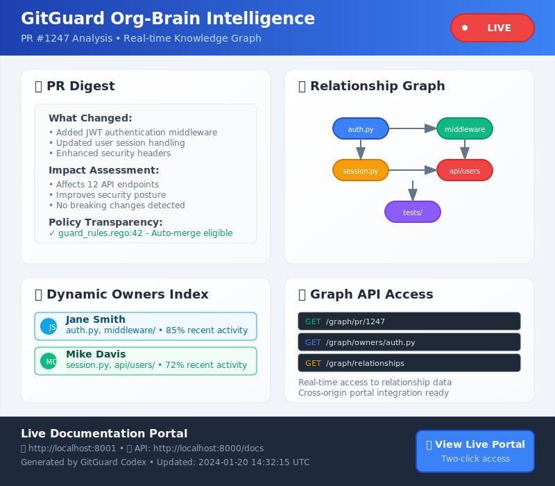

# GitGuard
## Intelligent Policy Engine for GitHub

<div class="hero-section">
  <div class="hero-content">
    <h3>Transform your GitHub workflow with intelligent policy automation</h3>
    <p>GitGuard provides automated policy enforcement, real-time risk assessment, and complete decision transparency for modern development teams.</p>
    <div class="cta-buttons">
      <a href="/getting-started" class="btn btn-primary">Get Started in 2 Minutes</a>
      <a href="/demo" class="btn btn-secondary">View Live Demo</a>
    </div>
  </div>
  <div class="hero-visual">
    
  </div>
</div>

## 🚀 Key Features

<div class="features-grid">
  <div class="feature-card">
    <div class="feature-icon">🛡️</div>
    <h3>Automated Policy Enforcement</h3>
    <p>Define policies in Rego and let GitGuard automatically evaluate every PR against your organization's standards.</p>
  </div>

  <div class="feature-card">
    <div class="feature-icon">📊</div>
    <h3>Real-time Risk Assessment</h3>
    <p>Dynamic risk scoring based on code changes, contributor patterns, and organizational context.</p>
  </div>

  <div class="feature-card">
    <div class="feature-icon">🔍</div>
    <h3>Complete Transparency</h3>
    <p>Every decision is explained with clear reasoning, policy references, and actionable feedback.</p>
  </div>

  <div class="feature-card">
    <div class="feature-icon">🧠</div>
    <h3>Org-Brain Intelligence</h3>
    <p>Relationship mapping and knowledge graphs provide context-aware decision making.</p>
  </div>

  <div class="feature-card">
    <div class="feature-icon">⚡</div>
    <h3>Zero-Config Setup</h3>
    <p>Deploy in minutes with our one-click GitHub App installation and sensible defaults.</p>
  </div>

  <div class="feature-card">
    <div class="feature-icon">🔧</div>
    <h3>Extensible Architecture</h3>
    <p>Plugin system, MCP integration, and REST APIs for seamless workflow integration.</p>
  </div>
</div>

## Quick Start

```bash
# 1. Install GitGuard
git clone https://github.com/your-org/gitguard.git
cd gitguard

# 2. Configure your policies
cp config/policies/examples/* config/policies/

# 3. Deploy with Docker
docker-compose up -d

# 4. Install GitHub App
# Visit: https://github.com/apps/gitguard-policy-engine
```

<div class="quick-links">
  <a href="/getting-started" class="quick-link">
    <div class="quick-link-icon">🚀</div>
    <div class="quick-link-content">
      <h4>Getting Started</h4>
      <p>Complete setup guide</p>
    </div>
  </a>

  <a href="/api" class="quick-link">
    <div class="quick-link-icon">📚</div>
    <div class="quick-link-content">
      <h4>API Reference</h4>
      <p>Complete API documentation</p>
    </div>
  </a>

  <a href="/policies" class="quick-link">
    <div class="quick-link-icon">📋</div>
    <div class="quick-link-content">
      <h4>Policy Guide</h4>
      <p>Writing effective policies</p>
    </div>
  </a>

  <a href="/examples" class="quick-link">
    <div class="quick-link-icon">💡</div>
    <div class="quick-link-content">
      <h4>Examples</h4>
      <p>Real-world use cases</p>
    </div>
  </a>
</div>

## Live Examples

### Policy Decision Flow


### Org-Brain Intelligence


### Documentation Portal


## GitGuard Codex Integration

This portal is auto-generated by Temporal workflows reacting to GitHub events:
- Release window status is annotated live via OPA
- PR pages document risk math, policy outcomes, and deltas
- Real-time relationship mapping and knowledge graphs

## Community & Support

- **GitHub**: [Issues & Discussions](https://github.com/your-org/gitguard)
- **Documentation**: [docs.gitguard.dev](https://docs.gitguard.dev)
- **API Reference**: [api.gitguard.dev](https://api.gitguard.dev)
- **Community**: [Discord Server](https://discord.gg/gitguard)

---

<div class="footer-cta">
  <h3>Ready to transform your development workflow?</h3>
  <p>Join hundreds of teams already using GitGuard for intelligent policy automation.</p>
  <a href="/getting-started" class="btn btn-primary btn-large">Get Started Now</a>
</div>
