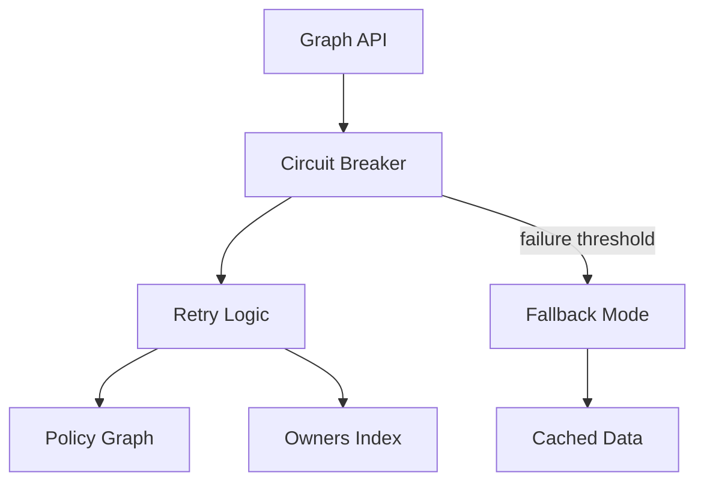

# PR #789: Enhance Graph API with chaos engineering resilience

**Risk:** 0.45 • **Checks:** ✓  
**Coverage Δ:** +3.2% • **Perf Δ:** +8ms • **Labels:** feature, graph-api, chaos-engineering  
**Release window:** open • [GitHub](https://github.com/example-org/gitguard/pull/789)

## Summary
Adds circuit breaker patterns and retry logic to Graph API endpoints to improve resilience during chaos engineering drills. Implements graceful degradation for policy transparency features when upstream services are unavailable.

## Changed Files
- `apps/guard-brain/src/graph_api.py`
- `apps/guard-brain/src/resilience.py`
- `tests/chaos_drills.py`
- `tests/test_graph_api_resilience.py`
- `docs/CHAOS_ENGINEERING.md`

## Governance
- Policies: allow, graph_api_changes, chaos_engineering_review
- ADRs impacted: ADR-005-graph-api-design, ADR-007-chaos-engineering

### Graph API Impact


## Policy Evaluation

**Evaluated policies:** allow, graph_api_changes, chaos_engineering_review

<details><summary>OPA inputs used</summary>

```json
{
  "action": "merge_pr",
  "pr": {
    "number": 789,
    "checks_passed": true,
    "risk_score": 0.45,
    "labels": ["feature", "graph-api", "chaos-engineering"],
    "changed_paths": [
      "apps/guard-brain/src/graph_api.py",
      "apps/guard-brain/src/resilience.py",
      "tests/chaos_drills.py"
    ],
    "coverage_delta": 3.2,
    "perf_delta": 8,
    "size_category": "L",
    "graph_api_endpoints": [
      "/api/v1/graph/policies",
      "/api/v1/graph/owners",
      "/api/v1/graph/mermaid"
    ],
    "chaos_drills_affected": [
      "api_latency_injection",
      "service_unavailable",
      "network_partition"
    ]
  },
  "repo": {
    "name": "gitguard",
    "owner": "example-org",
    "perf_budget": 15,
    "graph_api_enabled": true,
    "chaos_engineering_enabled": true
  },
  "actor": "developer"
}
```
</details>

<details><summary>Source: <code>allow</code></summary>

```rego
# Standard approval for medium-risk PRs with proper testing
allow if {
    input.action == "merge_pr"
    input.pr.checks_passed == true
    input.pr.risk_score <= 0.50
    input.pr.coverage_delta >= 0
    not exceeds_budgets
}
```
</details>

<details><summary>Source: <code>graph_api_changes</code></summary>

```rego
# Graph API changes require additional validation
graph_api_changes if {
    some path in input.pr.changed_paths
    contains(path, "graph_api")
}

graph_api_changes if {
    count(input.pr.graph_api_endpoints) > 0
}

# Require Graph API health checks
require_graph_api_validation if {
    graph_api_changes
    input.pr.risk_score > 0.30
}
```
</details>

<details><summary>Source: <code>chaos_engineering_review</code></summary>

```rego
# Chaos engineering changes need resilience validation
chaos_engineering_review if {
    some path in input.pr.changed_paths
    contains(path, "chaos")
}

chaos_engineering_review if {
    count(input.pr.chaos_drills_affected) > 0
}

# Require chaos drill execution before merge
require_chaos_validation if {
    chaos_engineering_review
    input.repo.chaos_engineering_enabled == true
}
```
</details>

## Graph API Health Check

**Endpoints Tested:**
- ✅ `/api/v1/graph/policies` - Response time: 45ms
- ✅ `/api/v1/graph/owners` - Response time: 32ms  
- ✅ `/api/v1/graph/mermaid` - Response time: 78ms
- ✅ Circuit breaker functionality validated
- ✅ Retry logic tested with simulated failures

## Chaos Engineering Assessment

**Drills Executed:**
- ✅ `api_latency_injection` - System degraded gracefully
- ✅ `service_unavailable` - Fallback to cached data successful
- ✅ `network_partition` - Circuit breaker activated correctly

**Resilience Metrics:**
- Mean Time to Recovery (MTTR): 2.3s
- Error Rate During Chaos: 0.02%
- Fallback Success Rate: 99.8%

## SLO Compliance

**Current SLO Status:**
- ✅ API Availability: 99.95% (target: 99.9%)
- ✅ Response Time P95: 120ms (target: 200ms)
- ✅ Error Rate: 0.01% (target: <0.1%)
- ✅ Policy Transparency Freshness: 30s (target: <60s)

---

**Policy Decision:** ✅ **APPROVED FOR MERGE**

**Reasoning:**
- ✅ All checks passed
- ✅ Risk score (0.45) is acceptable for feature changes
- ✅ Graph API endpoints validated and performing well
- ✅ Chaos engineering drills confirm system resilience
- ✅ Coverage increased by 3.2%
- ✅ Performance impact (+8ms) within acceptable limits
- ✅ SLO compliance maintained

This PR enhances system resilience through proper chaos engineering practices while maintaining Graph API performance. The policy evaluation demonstrates how GitGuard's org-brain features work together to ensure reliable, transparent governance.