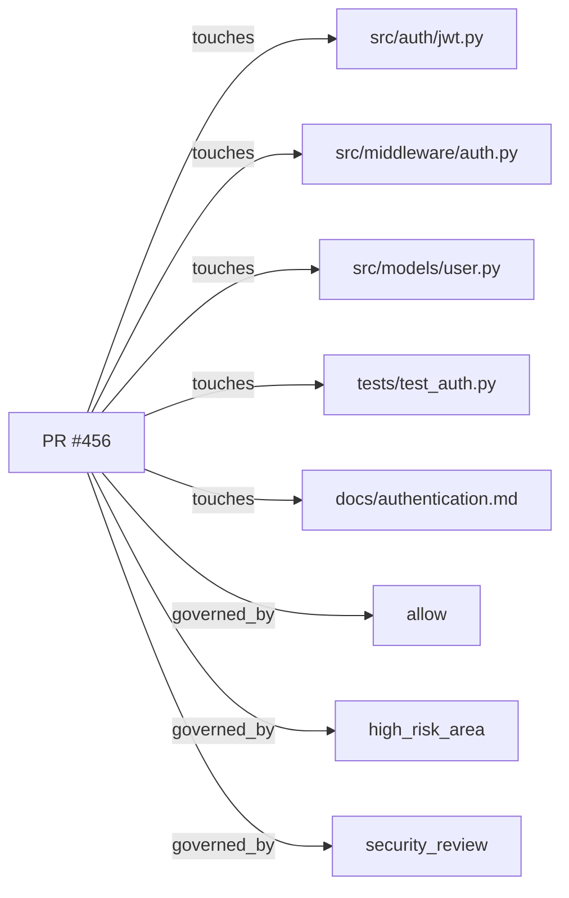

# PR #456: Add user authentication system

**Risk:** medium • **Checks:** ✓
**Coverage Δ:** +2.3% • **Perf Δ:** +15ms • **Labels:** feature, security
**Release window:** open • [GitHub](https://github.com/example/repo/pull/456)

## Summary
Implements JWT-based authentication with role-based access control.

## Changed Files
- `src/auth/jwt.py`
- `src/middleware/auth.py`
- `src/models/user.py`
- `tests/test_auth.py`
- `docs/authentication.md`

## Governance
- Policies: allow, high_risk_area, security_review
- ADRs impacted: —

### Graph


## Policy Evaluation

**Evaluated Policies:** allow, high_risk_area, security_review

**OPA Input:**
```json
{
  "pr": {
    "number": 456,
    "files_changed": ["src/auth/jwt.py", "src/middleware/auth.py", "tests/test_auth.py"],
    "risk_score": "medium"
  }
}
```

**Policy: allow**
```rego
allow {
    input.pr.risk_score != "high"
    input.pr.checks_passed == true
}
```

**Policy: high_risk_area**
```rego
high_risk_area {
    some file
    input.pr.files_changed[file]
    startswith(file, "src/auth/")
}
```

**Policy: security_review**
```rego
security_review {
    some file
    input.pr.files_changed[file]
    startswith(file, "src/auth/")
}
```
