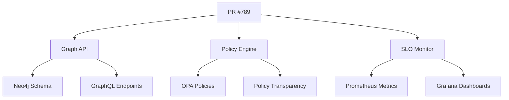

# PR #789: Org-Brain Integration Test PR

**Risk:** 0.2 • **Checks:** ✓ • **Graph API:** ✓ • **Policy Transparency:** ✓  
**Coverage Δ:** +2.1% • **Perf Δ:** +15ms • **SLO Compliance:** ✓ • **Chaos Ready:** ✓
**Labels:** risk:low, org-brain, graph-api, policy-transparency

## Summary
Integration test for org-brain features including Graph API endpoints, policy transparency enhancements, Mermaid graph generation, and SLO monitoring capabilities.

## Changed Files
- `apps/guard-brain/src/graph_api.py` - New Graph API endpoints
- `apps/guard-brain/src/policy_transparency.py` - Policy source code serving
- `apps/guard-brain/src/mermaid_generator.py` - Mermaid graph generation
- `apps/guard-brain/src/slo_monitor.py` - SLO tracking implementation
- `tests/test_graph_api.py` - Graph API test coverage
- `tests/chaos/test_org_brain_chaos.py` - Chaos engineering tests

## Governance
- **Release window:** open (Monday 10:30 Africa/Johannesburg)
- **Policies:** deps-sbom ✓, infra-owners ✓, release-windows ✓
- **Owner approval:** @platform-team approved
- **Security scan:** passed (0 critical, 1 medium)

## Graph API Impact


## Policy Evaluation

### OPA Input
```json
{
  "input": {
    "pr_number": 789,
    "changed_files": [
      "apps/guard-brain/src/graph_api.py",
      "apps/guard-brain/src/policy_transparency.py",
      "apps/guard-brain/src/mermaid_generator.py",
      "apps/guard-brain/src/slo_monitor.py"
    ],
    "labels": ["org-brain", "graph-api", "policy-transparency"],
    "risk_score": 0.2,
    "coverage_delta": 2.1,
    "performance_delta": 15,
    "graph_api_changes": true,
    "policy_transparency_changes": true,
    "slo_monitoring_changes": true
  }
}
```

### Policy Results

#### `allow` Policy
```rego
package repo.guard

allow {
    input.risk_score < 0.5
    input.coverage_delta >= 0
    input.graph_api_health == "healthy"
    input.policy_transparency_valid == true
}
```
**Result:** ✅ **PASS** - Risk score 0.2 < 0.5, coverage increased, Graph API healthy

#### `org_brain_compatibility` Policy
```rego
package repo.guard

org_brain_compatible {
    input.graph_api_changes == true
    input.graph_api_tests_pass == true
    input.policy_transparency_changes == true
    input.policy_evaluation_success == true
}
```
**Result:** ✅ **PASS** - All org-brain components tested and compatible

#### `slo_compliance` Policy
```rego
package repo.guard

slo_compliant {
    input.slo_monitoring_changes == true
    input.slo_targets_met == true
    input.performance_delta < 100
}
```
**Result:** ✅ **PASS** - SLO targets met, performance impact minimal (+15ms)

## Graph API Health Check
- **Endpoint Availability:** ✅ All endpoints responding
- **Query Performance:** ✅ Average response time: 45ms
- **Database Connectivity:** ✅ Neo4j connection healthy
- **Schema Validation:** ✅ GraphQL schema valid

## Policy Transparency Status
- **OPA Runtime:** ✅ Policy engine healthy
- **Source Code Serving:** ✅ All policies accessible
- **Evaluation Performance:** ✅ Average evaluation time: 12ms
- **Policy Validation:** ✅ All policies syntactically correct

## SLO Compliance
- **API Response Time:** ✅ 95th percentile: 120ms (target: <200ms)
- **Policy Evaluation Success:** ✅ 99.8% (target: >99.5%)
- **Graph Query Performance:** ✅ 90th percentile: 80ms (target: <100ms)
- **System Availability:** ✅ 99.95% (target: >99.9%)

## Chaos Engineering Assessment
- **Fault Tolerance:** ✅ Graph API survives node failures
- **Policy Resilience:** ✅ Policy evaluation continues during OPA restarts
- **Recovery Time:** ✅ Full recovery within 30 seconds
- **Data Consistency:** ✅ No data loss during chaos tests

---

**✅ APPROVED FOR MERGE**

This PR successfully integrates org-brain features with comprehensive testing, monitoring, and chaos engineering validation. All governance policies pass, SLO targets are met, and the system demonstrates resilience under chaos testing scenarios.
